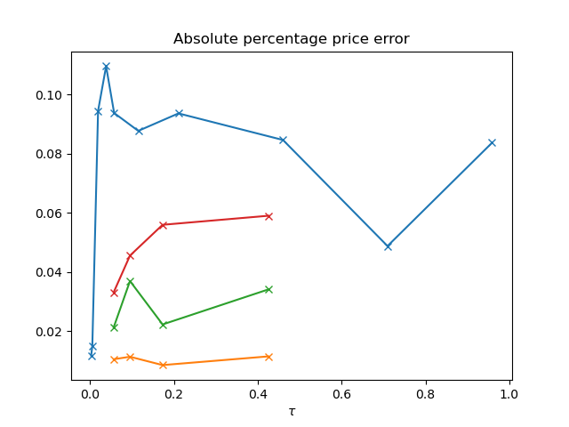

[](http://quantlet.de/)

## [](http://quantlet.de/) **local_parameter_estimation** [](http://quantlet.de/)

```yaml


Name of Quantlet:  local_parameter_estimation

Published in:    NA

Description:      'Comparison of implied moments of BTC, Gold, SPX, and SQQQ'

Submitted:  '6 Oct 20223'

Keywords: 
- 'Hawkes process'
- 'self-exciting process'
- 'inhomogeneous Poisson process'
- 'jumps'
- 'cryptos'


Author: 
- 'Francis Liu'

```




